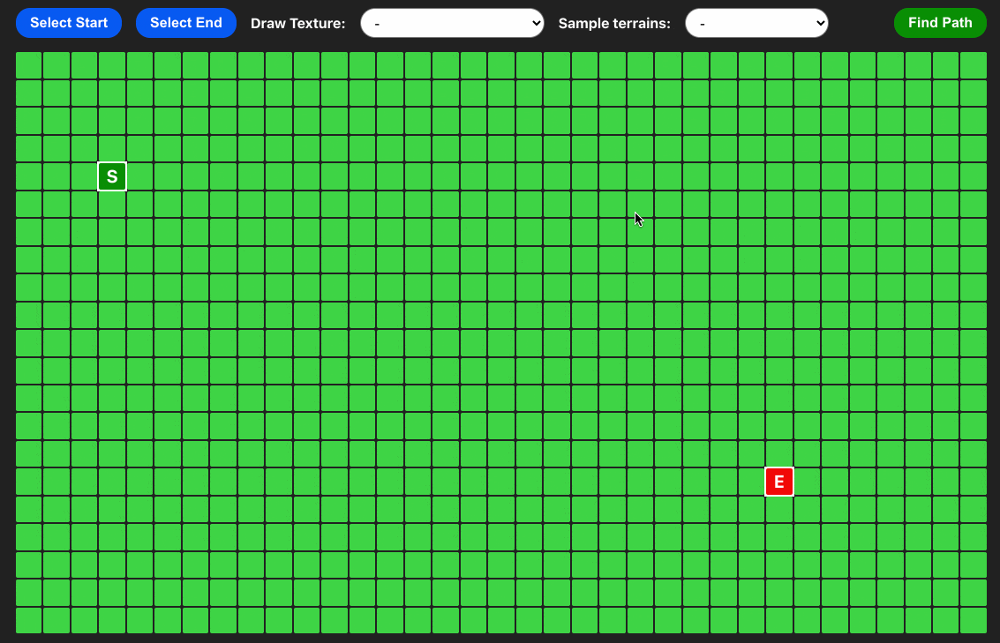

# Interactive Pathfinder

A single page web application that allows users to select start and end points from a grid and calculate the easiest path between them using Dijkstra's algorithm. They can also draw textures of varying difficulties to make the easiest path more complicated (or even impossible) to find. There are also several sample terrains that the user can test out and edit. This project was inspired by Clément Mihailescu's [Pathfinding Visualizer](https://www.youtube.com/watch?v=msttfIHHkak) video.

## Technology used

- React
- Create React App
- CSS
- JSDoc

A single page application that allows users to select start and end points from a grid and calculate the easiest path between them. They may also draw textures to make it easier or harder to reach the end. This pathfinder implements Dijkstra's algorithm to find a path with the lowest difficulty.

