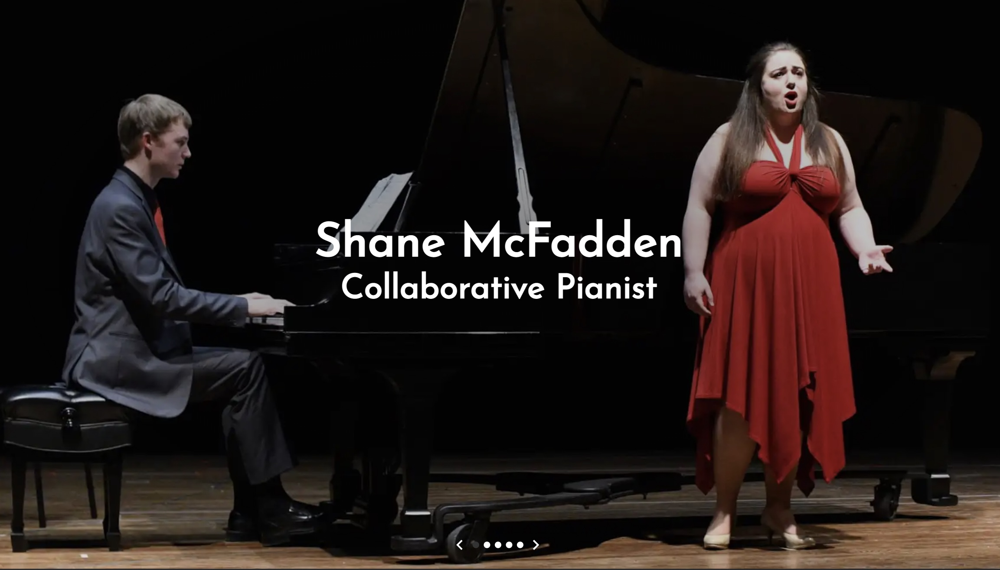

## mcfaddenpiano.com

A static website for my freelance music work. It contains a bio, photos, videos, and a contact form.
This project started when I outgrew SquareSpace. Although it was a wonderful way for me to design and deploy a website when I was working full time as a musician, I no longer need to rely on someone else's template to host a site that suits my needs. The site is live at [mcfaddenpiano.com](https://mcfaddenpiano.com), and it contains a bio, photos, videos, and a contact form.

### Technology used

- React
- Gatsby (a React framework for static websites)
- Sass (a CSS extension language)
- Netlify CDN

