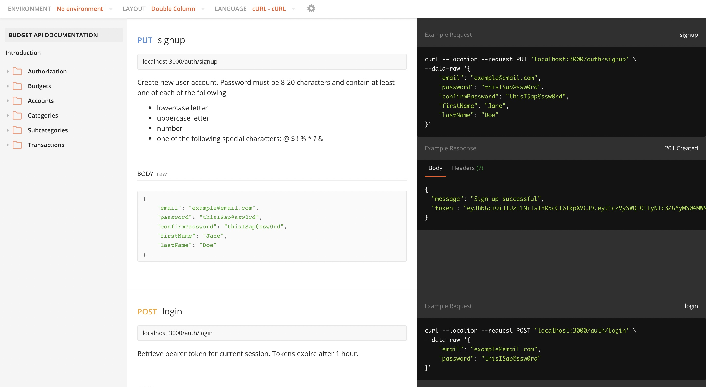

## Budget API

This is a back-end REST API for tracking budget data that can be attached to a front-end web or mobile application. Users can create multiple budgets and track their income and expenses across various bank accounts and transaction categories. I designed this API to be a customizable, scalable replacement to my Google Sheets budgets.

### Technology used

- TypeScript
- NodeJS
- Express (NodeJS web framework)
- MySQL (SQL Database)
- JSON Web Tokens (Authentication)
- Mocha, Chai, & Sinon (unit tests)
- Postman (integration tests/documentation)

